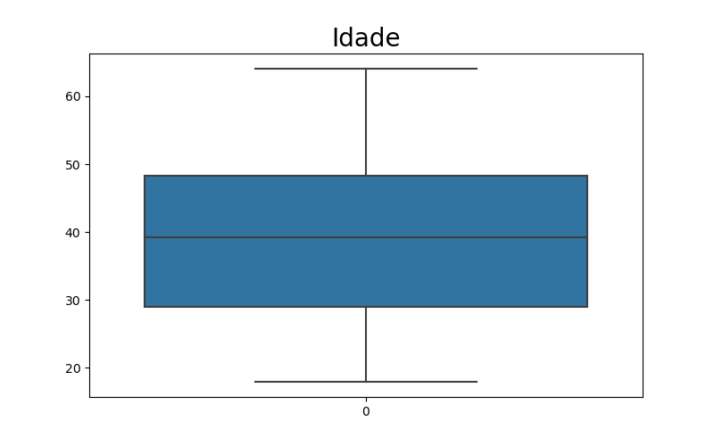

# sdw2023-data-science
####Este repositório serve para mostrar a progressão do meu desenvolvimento no Bootcamp de Data Science feito através da parceria entre o Banco Santander e a DIO

O objetivo desta análise de dados é prever preços de planos de saúde analisando informaçoes como idade, sexo, IMC, se é ou não fumante, etc.

Aqui podemos notar que há uma média de 8000 a 9000 reais por ano.

####Outliers

Os pontos que mais chamam atenção é que existem pessoas pagando mais de 60 mil reais por ano em planos de saúde, quanto a mediana é de 10 mil reais anuais.

####Gráfico de idades

####Gráficos IMC

Nota-se que a mediana nos diz que a maioria das pessoas que compram planos de saúde está acima do peso

O gráfico acima mostra outliers que indicam pessoas com obesidade mórbida adquirindo planos de saúde, o que faz jus ao boxplot de valores de plano, ja que pessoas obesas tendem a pagar mais caro nos planos.
